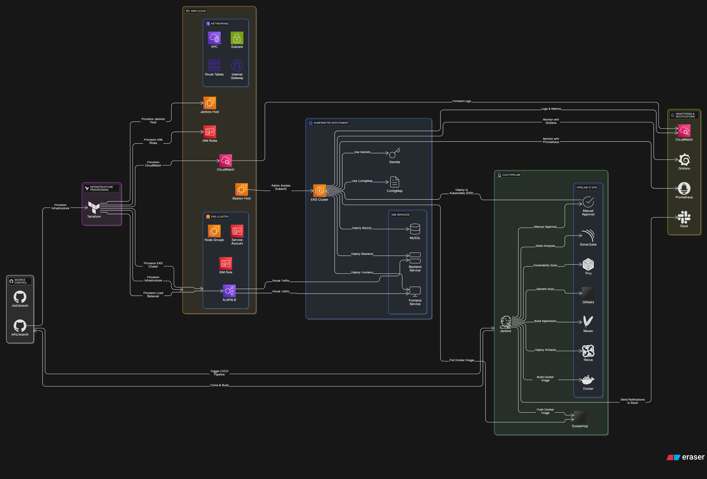
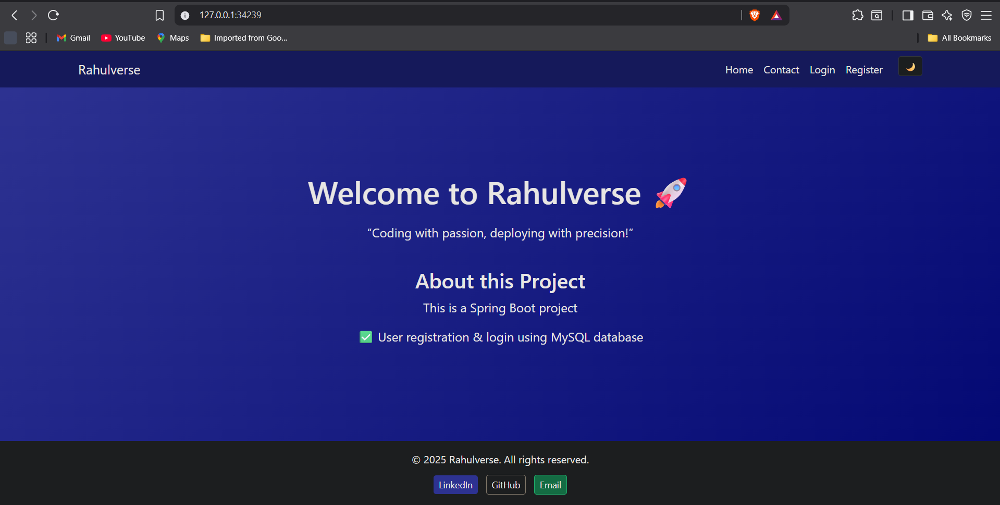

# 🚀 SpringBoot-Fullstack-UserPortal — Terraform | Jenkins | EKS 

[](https://github.com/Rahul-Kumar-Paswan/SpringBoot-Fullstack-UserPortal)
[](https://github.com/Rahul-Kumar-Paswan/SpringBoot-Fullstack-UserPortal/graphs/contributors)
[](https://aws.amazon.com/)


---

**SpringBoot-Fullstack-UserPortal** is a **full-stack user management application** built with **Spring Boot**, **Thymeleaf**, and **MySQL**, designed to demonstrate **end-to-end DevOps automation** using **Jenkins** and **Terraform**.

This project showcases how to:
- Provision **AWS infrastructure** using Terraform (**infra** branch)
- Automate **CI/CD pipelines** using Jenkins (**cicd-jenkins** branch)
- Implement **security, quality, and deployment automation** into a complete delivery workflow
- Deploy a **containerized full-stack app** into an **Amazon EKS cluster**

---

## 🖥️ Project Overview

This project demonstrates a **production-grade 3-tier DevOps pipeline**, covering every phase of application delivery — from AWS infrastructure provisioning using Terraform to secure, automated CI/CD workflows powered by Jenkins, Docker, and Kubernetes.

### 🔧 Application Stack

- ✅ **Frontend**: Built using **Thymeleaf templates** integrated within **Spring Boot** for server-side rendering  
- ✅ **Backend**: Developed in **Java (Spring Boot)** providing RESTful APIs and MVC-based dynamic pages  
- ✅ **Database**: **MySQL** deployed as a containerized StatefulSet within the Kubernetes cluster  
- ✅ **Containerization**: Entire application is **Dockerized** using a custom `Dockerfile` for consistent builds  
- ✅ **Configuration Management**: Application settings, database credentials, and environment variables managed via **Kubernetes Secrets** and **ConfigMaps**

### 🧱 Infrastructure

- ✅ Provisioned using **Terraform** (in the `infra` branch) — including VPC, subnets, EKS cluster, and EC2 instances  
- ✅ Deployed on **Amazon EKS (Elastic Kubernetes Service)** for orchestration and scalability  
- ✅ **EC2 instances** host DevOps tools such as **Jenkins**, **SonarQube**, and **Nexus** for CI/CD, code quality, and artifact management  
- ✅ **Kubernetes manifests** (`k8s/` directory) define deployments, services, secrets, and configuration files for both the app and MySQL database  

### ⚙️ CI/CD Pipeline (Jenkins)

- ✅ Implemented in **Jenkins**, running on an **AWS EC2 instance**  
- ✅ Fully automated multi-stage pipeline performs:
  - **Infrastructure provisioning/destroying** via Terraform (`infra` branch)
  - **Source code checkout**, **build**, and **test** with Maven  
  - **Static analysis** (SonarQube), **vulnerability scanning** (Trivy), and **secret scanning** (GitLeaks)  
  - **Docker image build and push** to Docker Hub  
  - **Kubernetes deployment** to EKS using manifests in the `k8s/` directory  
- ✅ Supports **parameterized builds** for on-demand environment creation or cleanup  
- ✅ Integrated with **Slack notifications** for real-time CI/CD status updates  

### 🔐 DevSecOps & Quality Integrations

- ✅ **SonarQube** — enforces code quality gates during build  
- ✅ **Trivy** — scans both source code and Docker images for vulnerabilities  
- ✅ **GitLeaks** — detects any hardcoded secrets within the Git repository  
- ✅ **Nexus Repository** — stores versioned Maven build artifacts securely  
- ✅ **Slack** — receives instant build and deployment notifications  
- ✅ **JUnit** — integrated testing ensures stable and reliable application delivery  

---

## 🧱 Architecture / Workflow


---
## 🧭 Table of Contents

- [🚀 SpringBoot-Fullstack-UserPortal — Terraform | Jenkins | EKS](#-springboot-fullstack-userportal---terraform--jenkins--eks)
- [🖥️ Project Overview](#️-project-overview)
  - [🔧 Application Stack](#-application-stack)
  - [🧱 Infrastructure](#-infrastructure)
  - [⚙️ CI/CD Pipeline (Jenkins)](#-cicd-pipeline-jenkins)
  - [🔐 DevSecOps & Quality Integrations](#-devsecops--quality-integrations)
- [🧱 Architecture / Workflow](#-architecture--workflow)
- [✨ Features](#-features)
  - [🧩 Application](#-application)
  - [🔐 Security & Code Quality](#-security--code-quality)
  - [⚙️ CI/CD & Automation](#-cicd--automation)
  - [☸️ Kubernetes & Scalability](#-kubernetes--scalability)
- [🧰 Tech Stack](#-tech-stack)
- [⚙️ Prerequisites](#-prerequisites)
  - [🧰 Tools & Software](#-tools--software)
  - [🔐 Access & Accounts](#-access--accounts)
- [📂 Project Structure](#-project-structure)
- [🛠️ Local Development](#️-local-development)
  - [🔧 Backend (Spring Boot)](#-backend-spring-boot)
  - [🧪 Access](#-access)
- [🐳 Docker Setup (Dev + Prod)](#-docker-setup-dev--prod)
  - [🐳 Build Image](#-build-image)
  - [🐳 Run Application with Docker](#-run-application-with-docker)
  - [🐳 Run MySQL Container (Optional Local DB)](#-run-mysql-container-optional-local-db)
  - [🐳 Docker Compose (Optional)](#-docker-compose-optional)
- [🏗️ Infrastructure (Terraform)](#️-infrastructure-terraform)
  - [🔹 Modules](#-modules)
    - [VPC & Networking](#vpc--networking)
    - [EKS Cluster & Node Groups](#eks-cluster--node-groups)
    - [EC2 Instances](#ec2-instances)
    - [IAM Roles & Policies](#iam-roles--policies)
  - [🔹 Usage](#-usage)
- [☸️ Kubernetes Deployment (EKS Cluster)](#️-kubernetes-deployment-eks-cluster)
  - [✅ Namespace Creation](#-namespace-creation)
  - [✅ Deploy Kubernetes Manifests](#-deploy-kubernetes-manifests)
    - [🔐 Secrets](#-secrets)
    - [⚙️ ConfigMaps](#-configmaps)
    - [🚀 Deployments](#-deployments)
  - [🔍 Verify Deployments](#-verify-deployments)
- [⚡ Jenkins CI/CD Pipeline for Current Project](#️-jenkins-cicd-pipeline-for-current-project)
  - [🧭 1. Manual Trigger](#-1-manual-trigger)
  - [🔁 2. Automatic Trigger (GitHub Webhook)](#-2-automatic-trigger-github-webhook)
  - [🔧 3. GitHub Webhook Setup](#-3-github-webhook-setup)
  - [⚙️ 4. Jenkins Job Configuration](#-4-jenkins-job-configuration)
  - [🔌 5. Jenkins Plugins Used](#-5-jenkins-plugins-used)
  - [6. 🧱 Pipeline Stages](#-6-pipeline-stages)
  - [7. 🔐 Tokens & Credentials in Jenkins](#-7-tokens-credentials-in-jenkins)
  - [8. ⚠️ Error Handling](#-8-error-handling)
  - [9. 📦 Artifact Storage](#-9-artifact-storage)
  - [10. 🌍 Environment Variables](#-10-environment-variables)
  - [11. 🌿 Branch Strategy](#-11-branch-strategy)
  - [12. 🛡️ Optional Security Enhancements](#-12-optional-security-enhancements)
- [🔧 Tools Configuration](#-tools-configuration)

### Integrations

- [🔔 Slack Integration (Build Notifications)](#-slack-integration-build-notifications)
  - [🧱 A. Create a Slack App](#-a-create-a-slack-app)
  - [🔑 B. Set Up OAuth & Permissions](#-b-set-up-oauth--permissions)
  - [💬 C. Add Bot to Slack Channel](#-c-add-bot-to-slack-channel)
  - [🧩 D. Configure Slack in Jenkins](#-d-configure-slack-in-jenkins)
    - [1. Install Slack Notification Plugin](#-1-install-slack-notification-plugin)
    - [2. Configure Slack Integration in Jenkins](#-2-configure-slack-integration-in-jenkins)
  - [🧪 E. Jenkinsfile Notification Snippet](#-e-jenkinsfile-notification-snippet)
- [🔍 SonarQube Integration (Code Quality)](#-sonarqube-integration-code-quality)
  - [🐳 A. Run SonarQube via Docker (Quick Start)](#-a-run-sonarqube-via-docker-quick-start)
  - [🌐 Access SonarQube UI](#-access-sonarqube-ui)
  - [🔑 B. Generate SonarQube Token](#-b-generate-sonarqube-token)
  - [🔌 C. Install SonarQube Scanner in Jenkins](#-c-install-sonarqube-scanner-in-jenkins)
  - [🌐 D. Configure SonarQube Server in Jenkins](#-d-configure-sonarqube-server-in-jenkins)
  - [🔁 E. Configure SonarQube Webhook (SonarQube → Jenkins)](#-e-configure-sonarqube-webhook-sonarqube--jenkins)
  - [F. ✅ SonarQube Integration Recap](#-f-sonarqube-integration-recap)
- [🧪 Trivy Integration (Security Scanning)](#-trivy-integration-security-scanning)
  - [🛠️ A. Install Trivy on Jenkins Agent (Ubuntu)](#-a-install-trivy-on-jenkins-agent-ubuntu)
  - [🧪 B. Use Trivy in Jenkinsfile](#-b-use-trivy-in-jenkinsfile)
- [🔐 GitLeaks Integration (Secret Detection)](#-gitleaks-integration-secret-detection)
  - [🛠️ A. Install GitLeaks](#-a-install-gitleaks)
  - [🧪 B. Use in Jenkinsfile](#-b-use-in-jenkinsfile)
- [✅ Jenkins Quality Gate Plugin (for SonarQube)](#-jenkins-quality-gate-plugin-for-sonarqube)
  - [📦 Install Plugin](#-install-plugin)
  - [💬 Use in Jenkinsfile](#-use-in-jenkinsfile)
- [🧱 Maven Setup (for Java-based Projects)](#-maven-setup-for-java-based-projects)
  - [🔌 A. Install Maven Plugin](#-a-install-maven-plugin)
  - [⚙️ B. Configure Maven Tool in Jenkins](#-b-configure-maven-tool-in-jenkins)
  - [🔧 C. Configure Maven Settings File](#-c-configure-maven-settings-file)
  - [📊 Tool Summary (Maven Java Project)](#-tool-summary-maven-java-project)

### Best Practices

- [🔒 Security & Best Practices](#-security--best-practices)
  - [☁️ AWS & Infrastructure Security](#-aws--infrastructure-security)
  - [🔐 Jenkins & Credential Management](#-jenkins--credential-management)
  - [🧩 Application & Kubernetes Security](#-application--kubernetes-security)
  - [🔍 Code Quality & Secret Scanning](#-code-quality--secret-scanning)
  - [💬 Notifications & Auditing](#-notifications--auditing)
  - [🛡️ Production Deployment Controls](#-production-deployment-controls)
- [💰 Cost Optimization](#-cost-optimization)
- [📸 Screenshots / Demo](#️-screenshots--demo)
- [📚 Learning / Takeaways](#️-learning--takeaways)
- [📌 Project Status & Future Enhancements](#️-todo--future-enhancements)
- [🤝 Contributing](#️-contributing)
- [📝 License](#️-license)

---

## ✨ Features

### 🧩 Application

- ✅ **Full-stack Java application** built with **Spring Boot**, **Thymeleaf**, and **MySQL**  
- ✅ Dynamic, responsive **UI rendered with Thymeleaf templates** (`index`, `login`, `register`, `dashboard`)  
- ✅ **Spring MVC architecture** with controllers, services, and repositories for clean code separation  
- ✅ **MySQL database integration** managed via Spring Data JPA (`UserRepository`, `UserService`)  
- ✅ Configurable via **`application.properties`** for flexible environment settings  
- ✅ Fully **Dockerized** application using a single `Dockerfile` for consistent deployments  

---

### 🔐 Security & Code Quality

- ✅ **SonarQube** integrated for static code analysis and enforcing quality gates  
- ✅ **Trivy** used for scanning vulnerabilities in source code and Docker images  
- ✅ **GitLeaks** implemented to detect hardcoded secrets within the repository  
- ✅ Kubernetes **Secrets** and **ConfigMaps** used to manage sensitive environment variables  
- ✅ Adheres to **DevSecOps principles** — security integrated into every stage of the CI/CD pipeline  

---

### ⚙️ CI/CD & Automation

- ✅ **Fully automated Jenkins pipeline** hosted on **AWS EC2**  
- ✅ Parameterized pipeline to **create or destroy** AWS infrastructure using **Terraform** (`infra` branch)  
- ✅ CI/CD stages include: **Checkout → Build → Test → Scan → Package → Push → Deploy**  
- ✅ **Maven-based** build and testing for Java application lifecycle management  
- ✅ **SonarQube**, **Trivy**, and **GitLeaks** scans integrated into Jenkins stages  
- ✅ **Docker image build & push** to Docker Hub for each successful build  
- ✅ **Slack integration** for real-time build and deployment notifications  
- ✅ **Nexus Repository** used for artifact storage and versioning  

---

### ☸️ Kubernetes & Scalability

- ✅ Deployed on **Amazon EKS (Elastic Kubernetes Service)** for production-grade scalability  
- ✅ Kubernetes manifests (`k8s/`) define deployments, services, secrets, and configmaps  
- ✅ **MySQL** deployed as a StatefulSet for persistent data storage  
- ✅ **Service discovery** and internal communication managed via Kubernetes DNS  
- ✅ Supports **rolling updates** and **zero-downtime deployments** via `kubectl rollout`  
- ✅ Persistent storage managed using **EBS-backed PersistentVolumeClaims (PVCs)**  
- ✅ Easily portable — works on **Minikube** (local) and **EKS** (AWS) environments  

---

## 🧰 Tech Stack

| **Category**                | **Tool / Technology**       | **Description**                                                                |
| --------------------------- | --------------------------- | ------------------------------------------------------------------------------ |
| **Application Framework**   | Spring Boot (Java)          | Backend framework for RESTful APIs and full-stack MVC web applications         |
| **Frontend Rendering**      | Thymeleaf                   | Server-side HTML templates for dynamic UI pages                                |
| **Database**                | MySQL                       | Relational database for persistent user information                            |
| **Build & Dependency Mgmt** | Maven                       | Handles project dependencies, build lifecycle, and packaging                   |
| **Containerization**        | Docker                      | Packages the application and dependencies into portable, consistent containers |
| **Orchestration**           | Kubernetes (Minikube / EKS) | Manages containerized workloads and ensures scalable deployment                |
| **CI/CD Automation**        | Jenkins                     | Automates build, test, scan, and deployment pipelines                          |
| **Code Quality**            | SonarQube                   | Performs static code analysis and enforces quality gates                       |
| **Vulnerability Scanning**  | Trivy                       | Scans Docker images and file system for vulnerabilities                        |
| **Secret Scanning**         | GitLeaks                    | Detects hardcoded secrets and sensitive data in repositories                   |
| **Artifact Management**     | Nexus Repository            | Stores build artifacts and manages versioned dependencies                      |
| **Notification System**     | Slack Integration           | Sends real-time notifications about pipeline status                            |
| **Version Control**         | Git & GitHub                | Source code management and team collaboration                                  |
| **Scripting / Automation**  | Bash / Shell                | Used for deployment scripts, CI/CD automation, and environment setup           |
| **Cloud Provider**          | AWS (EKS, EC2, S3)          | Hosts infrastructure and Kubernetes clusters for production-grade deployments  |

---

## ⚙️ Prerequisites

Before you begin, make sure you have the following **tools**, **accounts**, and **access configurations** ready for deploying and automating the **SpringBoot-Fullstack-UserPortal** project.

---

### 🧰 Tools & Software

| Tool / Software                                                                    | Purpose                                                |
| ---------------------------------------------------------------------------------- | ------------------------------------------------------ |
| [**Docker**](https://www.docker.com/)                                              | Containerize the Spring Boot application               |
| [**Java (JDK 17+)**](https://adoptium.net/)                                        | Required for building and running the Spring Boot app  |
| [**Maven**](https://maven.apache.org/)                                             | Build automation and dependency management             |
| [**Jenkins**](https://www.jenkins.io/)                                             | CI/CD automation for build, scan, and deployment       |
| [**Terraform CLI**](https://developer.hashicorp.com/terraform/downloads)           | Provision AWS infrastructure as code (IaC)             |
| [**AWS CLI**](https://docs.aws.amazon.com/cli/latest/userguide/install-cliv2.html) | Manage AWS resources and connect EKS clusters          |
| [**kubectl**](https://kubernetes.io/docs/tasks/tools/)                             | Manage Kubernetes resources                            |
| [**Minikube**](https://minikube.sigs.k8s.io/docs/) **or** [**Amazon EKS**](https://aws.amazon.com/eks/) | Local or cloud-based Kubernetes deployment environment |
| [**SonarQube**](https://www.sonarqube.org/)                                        | Static code analysis and quality gates enforcement      |
| [**Trivy**](https://aquasecurity.github.io/trivy/)                                 | Container and code vulnerability scanning              |
| [**GitLeaks**](https://github.com/gitleaks/gitleaks)                               | Secret detection in repositories                       |

---

### 🔐 Access & Accounts

| Access / Service                  | Purpose                                           |
| --------------------------------- | ------------------------------------------------- |
| **AWS Account + IAM User**        | For provisioning and managing infrastructure      |
| **Slack Workspace + Webhook URL** | Real-time Jenkins build and deployment alerts     |
| **SonarQube Server + Token**      | For code quality scanning                         |
| **GitHub Repository Access**      | For Jenkins webhook triggers and CI/CD pipelines  |
| **Docker Hub Credentials**        | For storing and pulling Docker images             |

> 💡 **Tip:** Ensure your **AWS credentials**, **Docker Hub login**, and **kubeconfig** are properly configured before triggering the Jenkins pipeline.

---

## 📂 Project Structure

```bash
.
├── Dockerfile                 # Docker image definition for the Spring Boot app
├── Jenkinsfile                # Jenkins pipeline for CI/CD automation
├── LICENSE                    # MIT license file
├── README.md                  # Project documentation
├── pom.xml                    # Maven configuration and dependency management
│
├── k8s/                       # Kubernetes manifests for deployment
│   ├── app-deployment.yaml    # Spring Boot app Deployment and Service definition
│   ├── configmap.yaml         # Environment variables and app configuration
│   ├── mysql-deployment.yaml  # MySQL StatefulSet and Service configuration
│   └── secret.yaml            # Kubernetes Secrets for database credentials
│
├── screenshots/               # Application UI screenshots for documentation
│
└── src/                       # Main Spring Boot application source code
    └── main/
    │   ├── java/com/rahulverse/    
    │   │   ├── controller/                # Web and REST controllers
    │   │   ├── model/                     # Entity classes (e.g., User)
    │   │   ├── repository/                # Spring Data JPA repositories
    │   │   ├── service/                   # Business logic and service implementations
    │   │   └── RahulverseApplication.java # Main Spring Boot application entry point
    │   └── resources/     
    │       ├── application.properties     # Application configuration file
    │       └── templates/                 # Thymeleaf HTML templates (UI pages)
    └── test/
        └── java/com/rahulverse/
            └── RahulverseApplicationTests.java # Unit tests for the application
```

---
## 🛠️ Local Development

### 🔧 Backend (Spring Boot)
```bash
# Navigate to project root
cd <project-root>

# Build the project using Maven
mvn clean install

# Run the application locally
mvn spring-boot:run
```

### 🧪 Access

Backend API will run by default on: http://localhost:8080

MySQL database can be configured locally via `application.properties` or Docker (see below).

### 🐳 Docker Setup (Dev + Prod)

#### 🐳 Build Image
```bash
docker build -t <your-backend-image-name> .
```

#### 🐳 Run Application with Docker
```bash
docker run -e SPRING_DATASOURCE_URL=jdbc:mysql://host.docker.internal:3306/rahulverse \
           -e SPRING_DATASOURCE_USERNAME=root \
           -e SPRING_DATASOURCE_PASSWORD=root \
           -p 8080:8080 \
           <your-backend-image-name>
```

#### 🐳 Run MySQL Container (Optional Local DB)
```bash
docker run --name mysql-db -e MYSQL_ROOT_PASSWORD=root -e MYSQL_DATABASE=rahulverse -p 3306:3306 -d mysql:8
```

#### 🐳 Docker Compose (Optional)
```bash
docker-compose up --build
```
- Spins up both Spring Boot app and MySQL database using predefined configurations.

### 🏗️ Infrastructure (Terraform)

Terraform provisions all required infrastructure for Kubernetes deployment and supporting services.  
> **Note:** The Terraform code resides in the `infra` branch, separate from the main project directory.

#### 🔹 Modules

- **VPC & Networking:** `modules/vpc/`  
  Configures VPC, subnets, internet gateway, route tables, and security groups.

- **EKS Cluster & Node Groups:** `modules/eks/`  
  Creates Amazon EKS cluster with worker node groups for container workloads.

- **EC2 Instances:** `modules/ec2/`  
  Provisions EC2 instances for Jenkins, SonarQube, or other supporting tools.

- **IAM Roles & Policies:**  
  Attached to EC2 instances or NodeGroups (**no IRSA used** in this project).

#### 🔹 Usage

```bash
# Switch to the infra branch
git checkout infra

cd Infra/

# Initialize Terraform
terraform init

# Plan infrastructure changes
terraform plan -var-file="envs/prod.tfvars"

# Apply infrastructure
terraform apply -var-file="envs/prod.tfvars"
```
- After applying, Terraform outputs relevant resources like VPC ID, EKS cluster name, and EC2 instance details.

---

## ☸️ Kubernetes Deployment (EKS Cluster)

This project uses **Kubernetes manifests** to deploy the Spring Boot backend and MySQL database on EKS or a local cluster (Minikube).  
> 💡 Note: The namespace is automatically created by Terraform during infrastructure provisioning.

### ✅ Namespace Creation

The Kubernetes namespace (e.g., `prod` or `dev`) is provisioned via Terraform.  
You **do not** need to manually create it before applying manifests.

### ✅ Deploy Kubernetes Manifests

Apply the manifests in the target namespace:

```bash
kubectl apply -f k8s/secret.yaml -n prod
kubectl apply -f k8s/configmap.yaml -n prod
kubectl apply -f k8s/mysql-deployment.yaml -n prod
kubectl apply -f k8s/app-deployment.yaml -n prod
```
- These manifests include the following resources:

#### 🔐 Secrets
- **`secret.yaml`**  
  Contains MySQL root credentials and any other sensitive environment variables for the backend.

#### ⚙️ ConfigMaps
- **`configmap.yaml`**  
  Application configuration variables injected into the Spring Boot backend.

#### 🚀 Deployments
- **`mysql-deployment.yaml`**  
  Deploys MySQL as a StatefulSet with PersistentVolumeClaims (PVC) for data persistence.

- **`app-deployment.yaml`**  
  Deploys the Spring Boot backend application with environment variables from Secrets and ConfigMaps.

#### 🔍 Verify Deployments
After applying the manifests, check the status of your resources:

```bash
# Check pods
kubectl get pods -n <namespace>

# Check services
kubectl get svc -n <namespace>

# Optional: view logs of a pod
kubectl logs <pod-name> -n <namespace>
```
- ⚡ Tip: Replace <pod-name> and <namespace> with the actual pod name and namespace.

---

## ⚡ Jenkins CI/CD Pipeline for Current Project

This document outlines the **Jenkins CI/CD pipeline configuration** for the current project.  
It covers **manual and automatic triggers**, **pipeline stages**, **security scans**, **Docker deployment**, and **infrastructure management**.

---

### 🧭 1. Manual Trigger

1. Navigate to your **Jenkins job**.
2. Click **Build with Parameters**.
3. Select the **branch** to deploy:
   - `main` / `dev` → Application code
   - `infra` → Infrastructure provisioning or destruction
4. Select **action**:
   - `deploy` → Deploys the application and/or infrastructure  
   - `destroy` → Destroys the infrastructure (Kubernetes namespace, AWS resources, etc.)
5. Click **Build** to execute.

> ⚠️ **Note:** Selecting `destroy` is **irreversible**. Verify the branch and environment before running.

---

### 🔁 2. Automatic Trigger (GitHub Webhook)

1. Navigate to your **GitHub repository → Settings → Webhooks**.
2. Click **Add Webhook** and configure:
   - **Payload URL:**  
     ```
     http://<jenkins-url>/github-webhook/
     ```
   - **Content type:** `application/json`
   - **Trigger events:** ✅ **Push events**
3. Save the webhook.

> ⚠️ **Ensure Jenkins is publicly accessible** or configured via a proxy for GitHub webhooks to trigger successfully.

---
### 🔧 3. GitHub Webhook Setup

1. ✅ Find your Jenkins public IP or domain:  
   `http://<YOUR_PUBLIC_IP>:8080`

2. ✅ In your GitHub repository, go to:  
   **Settings → Webhooks → Add Webhook**

3. ✅ Fill out the webhook form:

| **Field**        | **Value**                                              |
| ---------------- | ------------------------------------------------------ |
| **Payload URL**  | `http://<YOUR_JENKINS_PUBLIC_IP>:8080/github-webhook/` |
| **Content Type** | `application/json`                                     |
| **Secret**       | *(Optional for added security)*                        |
| **Events**       | ✅ Just the **Push event**                              |

4. ✅ Click **Add Webhook**

5. ✅ After adding, check **Recent Deliveries** → a successful webhook shows:  
   **Response: 200 OK**

---

### ⚙️ 4. Jenkins Job Configuration

| **Setting**              | **Value / Description**                             |
|---------------------------|-----------------------------------------------------|
| **Project Type**          | Pipeline                                            |
| **Pipeline Definition**   | Pipeline script from SCM                            |
| **SCM**                   | Git                                                 |
| **Repository URL**        | `https://github.com/<your-repo>.git`                |
| **Branches to build**     | Parameterized (`main`, `dev`, `infra`)             |
| **Script Path**           | `Jenkinsfile`                                       |

---

### 🔌 5. Jenkins Plugins Used

| **Plugin**                     | **Purpose**                                         |
| ------------------------------- | --------------------------------------------------- |
| **GitHub Integration Plugin**   | Connects Jenkins with GitHub for SCM and webhooks   |
| **Pipeline Plugin**             | Enables Pipeline-as-Code (Jenkinsfile)              |
| **Stage View Plugin**           | Provides visual representation of pipeline stages   |
| **Maven Integration Plugin**    | Adds Maven build tool integration to Jenkins        |
| **Maven Pipeline Integration**  | Allows Maven builds to run seamlessly in pipelines  |
| **Docker Pipeline**             | Builds and pushes Docker images                     |
| **Kubernetes Plugin**           | Deploys workloads to Kubernetes clusters            |
| **SonarQube Scanner**           | Performs static code analysis and quality checks    |
| **Trivy Plugin**                | Scans containers and filesystems for vulnerabilities|
| **GitLeaks Plugin**             | Detects secrets in source code                      |
| **Config File Provider Plugin** | Manages Maven, Kubernetes, or custom config files   |
| **AWS Credentials Plugin**      | Provides secure integration with AWS credentials    |
| **Slack Notification Plugin**   | Sends real-time build and deployment notifications  |

---

### 6. 🧱 Pipeline Stages

| Stage                                | Purpose                                        | Observations                                                                                                                                                                                                       |
| ------------------------------------ | ---------------------------------------------- | ------------------------------------------------------------------------------------------------------------------------------------------------------------------------------------------------------------------ |
| **Cleanup Workspace**                | Clean workspace to prevent leftover artifacts  | `cleanWs()` ensures a fresh build environment.                                                                                                                                                                     |
| **Checkout**                         | Pull code from GitHub branch `cicd-test-4`     | Uses credentials (`git-token`) correctly.                                                                                                                                                                          |
| **Code Compilation**                 | Compile Java code using Maven                  | Skips tests for faster build; compiled classes stored in `target/classes`.                                                                                                                                         |
| **Unit & Integration Tests**         | Run unit tests and integration tests           | ✅ Uses Dockerized MySQL and waits until it’s ready. <br> ✅ Executes `mvn test` for both unit and integration tests. <br> ✅ Cleans up MySQL container after tests. <br> ✅ Test results collected via JUnit reports. |
| **Security Scan - Gitleaks**         | Detect secrets in the repo                     | Report archived regardless of results.                                                                                                                                                                             |
| **SonarQube Analysis**               | Code quality scanning                          | Runs Sonar scanner on `target/classes` (compiled code).                                                                                                                                                            |
| **Quality Gate Check**               | Enforce SonarQube quality gates                | Pipeline aborts automatically if quality gate fails.                                                                                                                                                               |
| **Trivy FS Scan**                    | File system vulnerability scan                 | Exits with code 1 if HIGH/CRITICAL vulnerabilities are detected.                                                                                                                                                   |
| **Build Artifact & Deploy to Nexus** | Maven deploy to Nexus                          | Skips tests here; uses Maven settings from `nexus-config`.                                                                                                                                                         |
| **Docker Build & Push**              | Build Docker image, scan, and push to registry | ✅ Includes Trivy scan on Docker image before push. <br> ✅ Uses Docker registry credentials.                                                                                                                     |
| **Deploy to Kubernetes**             | Deploy app and MySQL to EKS                    | Creates namespace if missing, applies secrets/configmaps, deploys MySQL first, then the app.                                                                                                                       |
| **Verify Deployment**                | Confirm Kubernetes resources                   | `kubectl get pods` and `kubectl get svc` ensures deployment is running and visible.                                                                                                                                |
| **Slack Notifications**              | Sends **pipeline status** (success/failure)    | Uses Slack integration to notify build results. Also runs `kubectl get pods` and `kubectl get svc` to verify that deployments are running and accessible.                                                          |
---

## 7. 🔐 Tokens & Credentials in Jenkins

| **ID / Credential** | **Used For / Purpose**                                                                 |
| -------------------- | -------------------------------------------------------------------------------------- |
| `git-token`          | GitHub repository access (for SCM checkout)                                            |
| `aws-cred`           | AWS CLI authentication for EKS & infrastructure provisioning                           |
| `docker-cred`        | Docker registry authentication (image push/pull)                                       |
| `slack-token`        | Slack bot token for pipeline notifications                                             |
| `sonar-token`        | SonarQube server authentication                                                        |
| `prod-tfvars`        | Terraform variable file for production environment                                     |
| `kubeconfig`         | Kubernetes cluster access (optional if using AWS EKS credentials via IAM)              |
| `SLACK_CHANNEL`      | Slack channel to send pipeline notifications (e.g., `#jenkins-notification`)           |

⚠️ **Important:** Never hardcode credentials — always use the **Jenkins Credentials Manager** for storing and referencing sensitive data securely.

---

## 8. ⚠️ Error Handling
The pipeline **fails immediately** if:
- Docker build or push fails  
- Kubernetes deployment fails  
- Security scans detect critical issues  

Jenkins UI displays the **failing stage and logs** for troubleshooting.

---

## 9. 📦 Artifact Storage
- **Trivy** and **GitLeaks** reports are archived as Jenkins artifacts.  
- HTML reports are viewable directly in Jenkins using the **HTML Publisher plugin**.  

---

## 10. 🌍 Environment Variables
- Docker image tags, Kubernetes namespace, and runtime variables are dynamically injected during deployment.  
- **Infrastructure branch (`infra`)** uses its own Terraform and manifest variables.  

---

## 11. 🌿 Branch Strategy

| Branch         | Purpose                                                |
| -------------- | ------------------------------------------------------ |
| `main` / `dev` | Application code, builds, and deployments              |
| `infra`        | Infrastructure code and Terraform/Kubernetes manifests |

⚠️ Ensure deployment branch matches intended environment to avoid overwriting production.

---

## 12. 🛡️ Optional Security Enhancements
- Add **GitHub webhook secret** for secure triggers.  
- Enable **SonarQube branch analysis** for pull requests.  
- Implement **multi-stage approval** for `destroy` actions to prevent accidental deletion.  

---
## Environment Variables

| Variable           | Description                                                                    |
| ------------------ | ------------------------------------------------------------------------------ |
| AWS_REGION         | AWS region where EKS cluster is hosted (e.g., ap-south-1)                      |
| APP_NAME           | Name of the application (e.g., userportal-app)                                 |
| PROJECT_NAME       | Name of the project/repo (e.g., springboot-fullstack-userportal)               |
| DOCKER_REGISTRY    | Docker registry/user prefix (e.g., rahulkumarpaswan)                           |
| BUILD_VERSION      | Version for Docker image (e.g., v1.${BUILD_NUMBER})                            |
| DOCKER_IMAGE       | Full Docker image name (e.g., ${DOCKER_REGISTRY}/${APP_NAME}:${BUILD_VERSION}) |
| K8S_CLUSTER_NAME   | EKS cluster name (e.g., SpringBoot-eks-cluster)                                |
| NAMESPACE          | Kubernetes namespace to deploy to (e.g., prod)                                 |
| SLACK_CHANNEL      | Slack channel for notifications (e.g., #jenkins-notification)                  |
| SCANNER_HOME       | Path to SonarQube scanner tool (e.g., Jenkins tool path for SonarQube)         |
| SONAR_PROJECT_KEY  | SonarQube project key (e.g., userportal-app)                                   |
| SONAR_PROJECT_NAME | SonarQube project display name (e.g., UserPortal - Spring Boot Application)    |
| MYSQL_DB_NAME      | Database name for integration tests (e.g., userportal_db)                      |

---
## 🔧 Tools Configuration
- ✅ Maven for Java build and dependency management
- ✅ Docker for containerization
- ✅ Kubernetes (`kubectl`) for deployments
- ✅ AWS CLI for EKS and cloud provisioning
- ✅ SonarQube for code quality scanning
- ✅ Trivy for Docker image vulnerability scanning
- ✅ GitLeaks for secret detection in repository
- ✅ Jenkins Slack plugin for notifications
- ✅ Jenkins Quality Gate plugin for SonarQube integration
---

## 🔔 1. Slack Integration (Build Notifications)

### 🧱 A. Create a Slack App

1. Go to: [https://api.slack.com/apps](https://api.slack.com/apps)
2. Click **Create New App** → Select **From scratch**
3. Fill in the form:
   - **App Name**: `JenkinsBot`
   - **Workspace**: Your Slack workspace

### 🔑 B. Set Up OAuth & Permissions

1. In your Slack App, go to **OAuth & Permissions**
2. Under **Bot Token Scopes**, click **Add an OAuth Scope**
3. Add the following scopes:
   - `chat:write` – to send messages
   - `chat:write.public` – (optional) to send messages to public channels not joined yet
4. Click **Install App to Workspace**
5. Copy the **Bot User OAuth Token** (e.g., `xoxb-...`)

### 💬 C. Add Bot to Slack Channel

In your desired Slack channel (e.g. `#jenkins-notification`), type:

```bash
/invite @JenkinsBot
```

### 🧩 D. Configure Slack in Jenkins

#### 1. Install Slack Notification Plugin

- Navigate to: **Manage Jenkins → Plugin Manager → Available**
- Search for: `Slack Notification Plugin`
- Click **Install** and restart Jenkins if prompted

#### 2. Configure Slack Integration in Jenkins

- Go to: **Manage Jenkins → Configure System**
- Scroll down to the **Slack** section

Fill in the following details:

- **Team Domain**: `yourworkspace`  
  *(e.g., if your Slack URL is `yourworkspace.slack.com`)*

- **Channel**: `#jenkins-notification`

- **Integration Token Credential ID**:
  1. Click **Add → Secret Text**
  2. Paste your **Slack Bot Token** (starts with `xoxb-...`)
  3. Set an ID: `slack-token` (or any name you'll reference later)

- **Test Connection**:  
  Click to verify integration — you should see ✅ **Success**

- Click **Save**

### 🧪 E. Jenkinsfile Notification Snippet
```groovy
post {
    success {
        slackSend(channel: '#jenkins-notification', color: 'good', 
          message: "✅ SUCCESS: Build <${env.BUILD_URL}|#${BUILD_NUMBER}> deployed to production.")
    }
    failure {
        slackSend(channel: '#jenkins-notification', color: 'danger', 
          message: "❌ FAILURE: Build #${BUILD_NUMBER} failed. Check Jenkins logs.")
    }
}
```
- ✅ You can enhance with formatting, emojis, mentions, etc.

---

## 🔍 2. SonarQube Integration (Code Quality)

SonarQube helps analyze and maintain code quality using static code analysis.

### 🐳 A. Run SonarQube via Docker (Quick Start)

```bash
docker run -d --name sonarqube \
  -p 9000:9000 \
  -e SONAR_ES_BOOTSTRAP_CHECKS_DISABLE=true \
  sonarqube:lts

```

### 🌐 Access SonarQube UI

After running SonarQube (e.g. via Docker), access the web UI:

- URL: `http://<your-sonarqube-IP>:9000`
- **Default credentials**:
  - Username: `admin`
  - Password: `admin` (you'll be prompted to reset this)


### 🔑 B. Generate SonarQube Token

To allow Jenkins to authenticate with SonarQube:

1. Login to SonarQube
2. Go to: `My Account → Security`
3. Click **Generate Token**
4. Name it (e.g., `sonar-token`)
5. **Copy and save** the token securely — it will be used in Jenkins


### 🔌 C. Install SonarQube Scanner in Jenkins

1. Navigate to: `Manage Jenkins → Plugin Manager → Available`
2. Search and install: **SonarQube Scanner**
3. Then go to: `Manage Jenkins → Global Tool Configuration`
4. Scroll to **SonarQube Scanner**
5. Click **Add SonarQube Scanner** and configure:
   - **Name**: `sonar-scanner` ✅ (must match usage in your `Jenkinsfile`)
   - ✅ Check: **Install Automatically**
6. Click **Save**

### 🌐 D. Configure SonarQube Server in Jenkins

To allow Jenkins to connect to the SonarQube server:

1. Go to: `Manage Jenkins → Configure System`
2. Scroll to the **SonarQube servers** section
3. Click **Add SonarQube** and enter:
   - **Name**: `sonar` ✅ (must match with `withSonarQubeEnv('sonar')` in your Jenkinsfile)
   - **Server URL**: `http://<your-sonarqube-IP>:9000`
   - **Server Authentication Token**:
     - Click **Add → Secret Text**
     - Paste the token you generated earlier
     - Give it an ID (e.g., `sonar-token`)
4. Select the added token in the dropdown
5. Click **Save**

### 🔁 E. Configure SonarQube Webhook (SonarQube → Jenkins)

SonarQube uses a webhook to notify Jenkins when the **Quality Gate** result is ready. This is essential for using:

```groovy
waitForQualityGate abortPipeline: true
```
📍 **Step 1: Ensure Jenkins Webhook Endpoint**

Your Jenkins must be reachable from SonarQube. The default webhook URL is:

`http://<jenkins-IP>:8080/sonarqube-webhook/`

📍 **Step 2: Add Webhook in SonarQube**
1. Open SonarQube in your browser:
 `http://<your-sonarqube-IP>:9000`

2. Login as **admin**

3. Navigate to:  
**Administration → Configuration → Webhooks**

4. Click **Create**

5. Fill in the details:
- **Name**: `jenkins`
- **URL**:  
  ```
  http://<jenkins-IP>:8080/sonarqube-webhook/
  ```

6. Click **Create**

✅ **Done!** SonarQube will now notify Jenkins after each analysis.

💡 **Optional**: You can also add project-level webhooks if you want different behavior per project:  
**Project Settings → Webhooks → Create**

### F. ✅ SonarQube Integration Recap
| Component       | Configured Where?                    | Value to Match                      |
| --------------- | ------------------------------------ | ----------------------------------- |
| `sonar-scanner` | Global Tool Configuration            | Name: `sonar-scanner`               |
| `sonar`         | Configure System → SonarQube Servers | Name: `sonar`                       |
| Webhook URL     | SonarQube UI → Webhooks              | Jenkins URL + `/sonarqube-webhook/` |

---
## 🧪 3. Trivy Integration (Security Scanning)

Trivy scans Docker images, filesystems, and repositories for vulnerabilities.

### 🛠️ A. Install Trivy on Jenkins Agent (Ubuntu)

Run the following commands to install Trivy:

```bash
sudo apt install wget apt-transport-https gnupg lsb-release -y
wget -qO - https://aquasecurity.github.io/trivy-repo/deb/public.key | sudo apt-key add -
echo "deb https://aquasecurity.github.io/trivy-repo/deb $(lsb_release -sc) main" | sudo tee /etc/apt/sources.list.d/trivy.list
sudo apt update
sudo apt install trivy -y
```

### 🧪 B. Use Trivy in Jenkinsfile

If already present, no changes are needed. Example usage:

```groovy
sh 'trivy fs --format table -o fs-report.html .'
```

---
## 🔐 4. GitLeaks Integration (Secret Detection)

### 🛠️ A. Install GitLeaks

Run the following command to install GitLeaks:

```bash
curl -sSL https://github.com/gitleaks/gitleaks/releases/latest/download/gitleaks_$(uname -s)_$(uname -m).tar.gz | \
tar -xz -C /usr/local/bin gitleaks
```
---
###### Confirm Installation

```bash
gitleaks version
```

### 🧪 B. Use in Jenkinsfile

If already present, no changes needed:

```groovy
sh 'gitleaks detect --source ./client --exit-code 1'
```

---

## ✅ 5. Jenkins Quality Gate Plugin (for SonarQube)

### 📦 Install Plugin

Go to: Manage Jenkins → Plugin Manager

Install: Quality Gates Plugin

---

### 💬 Use in Jenkinsfile

```groovy
waitForQualityGate abortPipeline: true, credentialsId: 'sonar-token'
```

---

## 🧱 6. Maven Setup (for Java-based Projects)

### 🔌 A. Install Maven Plugin
1. Go to **Manage Jenkins → Plugin Manager**.  
2. Ensure the **Maven Integration Plugin** is installed.  
3. If not, search for **“Maven Integration”** and install it.  

---

### ⚙️ B. Configure Maven Tool in Jenkins
1. Navigate to **Manage Jenkins → Global Tool Configuration**.  
2. Scroll to the **Maven** section and click **Add Maven**.  
3. Set the following configuration:  
   - **Name:** `maven3`  
     _(This must match the tools block: `tools { maven 'maven3' }` in your Jenkinsfile.)_  
   - **Install automatically:** ✅ Enabled  
   - **Version:** Select the latest available Maven version.  
4. Click **Save** to apply changes.  

---

### 🔧 C. Configure Maven Settings File
To deploy artifacts to **Nexus Repository** or configure custom repositories:

1. Go to **Manage Jenkins → Managed Files**.  
2. Click **Add a new Config → Maven Settings Config**.  
3. Set the following fields:
   - **ID / Name:** `nexus-config`  
     _(Must match `globalMavenSettingsConfig: 'nexus-config'` in your Jenkinsfile.)_
4. Add your Maven `settings.xml` content under **Settings File Content**, for example:

```xml
<settings>
  <servers>
    <server>
      <id>maven-releases</id>
      <username>${env.NEXUS_USERNAME}</username>
      <password>${env.NEXUS_PASSWORD}</password>
    </server>
    <server>
      <id>maven-snapshots</id>
      <username>${env.NEXUS_USERNAME}</username>
      <password>${env.NEXUS_PASSWORD}</password>
    </server>
  </servers>
</settings>
```
5. Save the configuration and ensure the ID matches your Jenkinsfile usage.

---
### 📝 D. Add or Change Nexus IP in `pom.xml`

To update or change the Nexus repository IP in your `pom.xml` for Maven deployment:

1. Open your `pom.xml` file in the project.

2. Add or modify the following configuration in the `<distributionManagement>` section to point to the correct Nexus IP:

```xml
<distributionManagement>
  <repository>
    <id>nexus-releases</id>
    <url>http://<NEXUS_IP>:8081/repository/maven-releases/</url>
  </repository>
  <snapshotRepository>
    <id>nexus-snapshots</id>
    <url>http://<NEXUS_IP>:8081/repository/maven-snapshots/</url>
  </snapshotRepository>
</distributionManagement>
```
3. Replace `<NEXUS_IP>` with the actual IP or DNS of your Nexus repository server.

4. Ensure that the `repository` and `snapshotRepository` URLs reflect the correct paths for your repository.

5. Commit and push the changes to the repository. This will ensure that the Maven build points to the correct Nexus instance during deployments.

---
## 📊 Tool Summary (Maven Java Project)
| Tool         | Purpose                              | Jenkins Configuration Area              |
| ------------ | ------------------------------------ | --------------------------------------- |
| Maven3       | Build & compile Java project         | Global Tool Configuration + Jenkinsfile |
| Nexus Config | Deployment to Nexus Repository       | Managed Files → Maven Settings Config   |
| JDK          | Compile Java                         | Global Tool Configuration + Jenkinsfile |
| Slack        | Notifications                        | Configure System + Jenkinsfile          |
| SonarQube    | Code quality scanning                | Configure System + Global Tool Config   |
| Trivy        | Docker/Filesystem vulnerability scan | Installed on Jenkins agent              |
| GitLeaks     | Secret scanning                      | Run manually or in Jenkinsfile          |
| Quality Gate | SonarQube CI enforcement             | Jenkinsfile + Plugin                    |

---

## 🔒 Security & Best Practices

### ☁️ AWS & Infrastructure Security
- **AWS Access:**  
  Currently uses **AWS access keys** stored securely in **Jenkins Credentials Manager** for provisioning and EKS access.  
  In future, this will be replaced by **EC2 Instance Roles (IAM Role-based Access)** for improved security and rotation-free access.

- **IAM Policies:**  
  Follows **least-privilege principle** for all IAM roles and policies across Jenkins, Terraform, and AWS services.  
  Each role is scoped to the minimum permissions needed (EKS, EC2, S3, IAM).

- **Terraform Backend Security:**  
  Terraform state is stored in an **S3 bucket with encryption (SSE-S3)** and **state locking enabled via DynamoDB** to prevent concurrent modifications.

---

### 🔐 Jenkins & Credential Management
- **Jenkins Credentials:**  
  All sensitive credentials (AWS keys, Docker Hub, SonarQube, GitHub, Nexus, Slack) are securely stored in the **Jenkins Credentials Manager**.  
  Credentials are injected into the pipeline dynamically using **Credentials Binding** — ❌ no secrets are hardcoded in scripts or manifests.

- **Jenkins Tool Management:**  
  Maven, SonarQube Scanner, Docker, and Trivy tools are configured using **Global Tool Configuration**, ensuring consistent builds and controlled versions.

- **Jenkins Hardening:**  
  - RBAC (Role-Based Access Control) enforced for users and folders.  
  - HTTPS enforced through reverse proxy or load balancer.  
  - Plugins regularly updated to the latest stable versions to avoid known vulnerabilities.

---

### 🐳 Docker & Image Security
- **Docker Image Security:**  
  Application containers run as **non-root users**, following the principle of least privilege.  
  Base images are minimal and verified before use.

- **Vulnerability Scanning:**  
  Integrated **Trivy** scans check both the **source filesystem** and **Docker images** for HIGH/CRITICAL vulnerabilities.  
  Reports are generated and archived as Jenkins artifacts.

---

### 🧩 Application & Kubernetes Security
- **Kubernetes Secrets:**  
  Application and database credentials are securely managed through **Kubernetes Secrets**, with namespace-based isolation (`prod`).

- **Configuration Management:**  
  Non-sensitive configurations are stored in **ConfigMaps**, enabling separation of code and environment data.

- **Deployment Security:**  
  During deployments, image tags are injected dynamically using `envsubst` — eliminating the risk of exposing secrets in manifests.  
  Namespace-level isolation ensures safe production rollouts.

---

### 🔍 Code Quality & Secret Scanning
- **Secret Scanning (GitLeaks):**  
  **GitLeaks** runs automatically in the Jenkins pipeline to detect any hardcoded credentials or secrets before builds progress.

- **Static Code Analysis (SonarQube):**  
  **SonarQube** enforces **Quality Gates** — builds fail if thresholds for maintainability, reliability, or security are not met.

---

### 💬 Notifications & Auditing
- **Slack Notifications:**  
  Uses a **secured Slack bot token** (stored in Jenkins Credentials Manager) for pipeline notifications — no open webhooks are used.

- **GitHub Integration:**  
  Webhooks are configured for **push events only** to reduce unnecessary exposure.  
  Future enhancement: Add a **webhook secret** for additional security validation.

---

### 🛡️ Production Deployment Controls
- **Namespace Isolation:**  
  Production workloads are deployed exclusively in isolated namespaces (e.g., `prod`), preventing cross-environment conflicts.

- **Approval Gates (Optional):**  
  Jenkins can include **manual approval stages** for production deployments or destructive actions (like `destroy` in Terraform).

---

✅ **Summary:**  
This project enforces a secure, auditable DevOps pipeline by managing AWS, Jenkins, Docker, and Kubernetes access with strict credential control and proactive scanning.  
Future plans include migrating from **AWS access keys → EC2 instance roles (IAM-based access)** for enhanced long-term security and compliance.

---

## 💰 Cost Optimization

- **EKS Node Sizing:**  
  Used `t3.small` EKS nodes to balance performance and cost effectively.

- **On-Demand Cleanup:**  
  Terraform `destroy` is used to remove idle infrastructure, preventing unnecessary cloud charges.

- **Modular Terraform:**  
  Supports selective resource provisioning, e.g., skip EC2 or RDS if not required.

- **Auto-Scaling:**  
  Node groups are configured with auto-scaling to handle workloads dynamically and reduce over-provisioning.

- **Spot Instances:**  
  Optional use of **spot instances** for development or non-critical workloads to further reduce costs.

- **Docker Optimization:**  
  Leveraged **Docker layer caching** to minimize build times and reduce bandwidth usage for image builds.

- **Jenkins Job Scheduling:**  
  Jobs can be scheduled or triggered manually to avoid redundant builds and save compute resources.

- **Environment-Specific Scaling:**  
  Separate `dev` and `prod` Terraform variable files (`tfvars`) are used to control resource sizes, replica counts, and costs.

- **Build & Artifact Efficiency:**  
  Maven builds skip unnecessary tests during CI/CD to conserve compute resources.

- **Resource Monitoring:**  
  Regularly monitor node utilization to adjust cluster size and reduce idle capacity.

---
## 📸 Screenshots / Demo
Access the UI using the frontend service's LoadBalancer IP.
Below is a sample of the QR Generator UI deployed on EKS.
  
_For more UI pages, check the [`/screenshots`](./screenshots) folder._

---

## 📚 Learning / Takeaways

- 🔐 **AWS Credentials & IAM:** Gained hands-on experience using **AWS access keys** for initial setups, with plans to migrate to **EC2 instance roles** for secure, scalable access in the future.
- ⚙️ **Modular Terraform:** Learned to structure infrastructure as reusable, environment-specific modules for provisioning VPCs, EKS clusters, and supporting resources.
- ☁️ **Full-Stack Deployment:** Built, containerized, and deployed a **Spring Boot + MySQL application** on **Amazon EKS**, demonstrating end-to-end deployment.
- 🔄 **CI/CD Automation with Jenkins:** Developed a robust pipeline including **automated build, test, security scan, and deployment** stages for application and infrastructure.
- 🧩 **Separation of Concerns:** Implemented clean separation between **application code**, **infrastructure code**, and **pipeline logic**.
- 🔒 **Security Integration:** Integrated **Trivy** (container & filesystem vulnerabilities) and **GitLeaks** (secret detection) into the CI/CD workflow.
- 📊 **Code Quality:** Used **SonarQube** for static code analysis, enforcing quality gates and tracking technical debt.
- 🛠️ **Kubernetes Mastery:** Hands-on experience with **Deployments, Services, ConfigMaps, Secrets, Namespaces**, and persistent storage via **StatefulSets and Persistent Volumes**.
- 🔔 **Pipeline Notifications:** Implemented **Slack notifications** for real-time feedback and team collaboration
- 🚀 **End-to-End Automation:** Automated the workflow from **infrastructure provisioning** to **application release**, ensuring repeatability and reliability.
- 🐳 **Containerization:** Containerized the backend (Spring Boot) and any frontend modules for consistent, scalable deployments.
- 💡 **GitOps & IaC Best Practices:** Strengthened understanding of **infrastructure-as-code** principles and GitOps workflow integration.
- 🔧 **Jenkins Toolchain Configuration:** Configured Node.js and Maven toolchains in Jenkins to support multi-language builds and pipelines.
- 🗄️ **Data Persistence:** Managed **persistent storage** for MySQL with **StatefulSets** and **Persistent Volumes** to ensure data durability.

---
## 📌 Project Status & Future Enhancements
| Feature                                       | Status                                         |
| --------------------------------------------- | ---------------------------------------------- |
| GitHub Webhooks for CI Trigger                | Implemented ✅                                  |
| Slack Notifications                           | Basic implemented ✅; advanced features planned |
| Helm Chart Support for Kubernetes Deployments | Planned 🚧                                     |
| Monitoring with Grafana + Prometheus          | Planned 🚧                                     |
| Auto-scaling for backend pods                 | Planned 🚧                                     |
| IRSA for AWS Access                           | Planned 🚧                                     |
| Multi-environment Terraform Workflows         | Planned 🚧                                     |
| Multi-stage Docker Builds for Optimization    | Planned 🚧                                     |
| Advanced SonarQube Rules / Quality Gates      | Planned 🚧                                     |
| Automated MySQL Backup & Restore              | Planned 🚧                                     |
| GitOps / ArgoCD Deployment                    | Optional 💡                                    |

---

## 🤝 Contributing
Contributions, issues, and feature requests are welcome!  
Feel free to fork this repo and submit a pull request. 

---
## 📝 License

MIT License © 2025 Rahul Paswan
This project is licensed under the [MIT License](./LICENSE).
