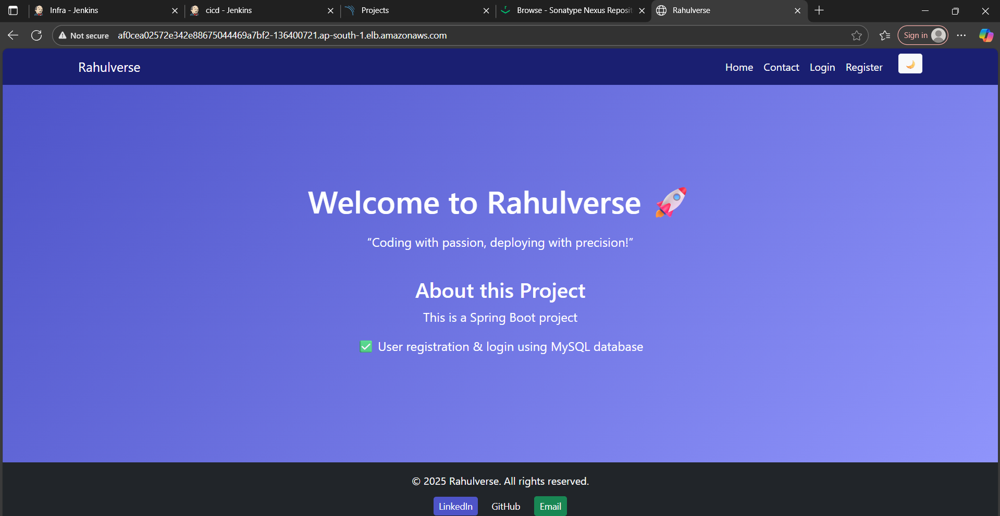

# 🚀 SpringBoot-Fullstack-UserPortal


**SpringBoot-Fullstack-UserPortal** is a full-stack user management application built with Spring Boot, Thymeleaf, and MySQL — now fully deployed in a **Kubernetes environment** for production-grade scalability and resilience.

  
_For more UI pages, check the [`/screenshots`](./screenshots) folder._

---

## 🖥️ Project Overview

A full-stack web application deployed using Kubernetes:

- **Backend:** Spring Boot (Java), MySQL  
- **Frontend:** Thymeleaf templates (server-side rendered)  
- **Authentication:** Simple login/register with session management  
- **Database:** MySQL for persistence  
- **Containerization:** Docker & Docker Compose for local development  
- **Orchestration:** Kubernetes (Deployments, Services, ConfigMaps, Secrets)  

---

## 🧰 Technologies Used

| Layer    | Tech Stack                                |
|----------|-------------------------------------------|
| Backend  | Spring Boot, Java, JPA                    |
| Frontend | Thymeleaf, HTML, CSS                      |
| Database | MySQL                                     |
| DevOps   | Docker, Kubernetes (kubectl, Deployments) |

---

## ⚙️ Prerequisites

Ensure the following are installed and configured:

- ✅ Java 17+  
- ✅ Maven 3.8+  
- ✅ Docker  
- ✅ Kubernetes Cluster (Minikube, KIND, or Cloud Provider)  
- ✅ `kubectl` CLI (connected to your cluster)  

---

## 🔐 Kubernetes Configuration Files

All manifests are located in the `k8s/` directory:

| File                    | Description                                     |
|-------------------------|-------------------------------------------------|
| `configmap.yaml`        | Database config (host, port, name, user)       |
| `secret.yaml`           | DB password securely stored as a Secret        |
| `mysql-deployment.yaml` | MySQL Deployment + Service + PVC + init SQL    |
| `app-deployment.yaml`   | Spring Boot App Deployment + LoadBalancer      |

---

## 🚀 Deploying to Kubernetes

### ✅ Step 1: Create Namespace
```bash
kubectl create namespace prod
```
✅ Step 2: Apply Kubernetes Manifests
From the root project directory:
```bash
kubectl apply -f k8s/configmap.yaml -n prod
kubectl apply -f k8s/secret.yaml -n prod
kubectl apply -f k8s/mysql-deployment.yaml -n prod
kubectl apply -f k8s/app-deployment.yaml -n prod
```
✅ Step 3: Verify Deployment
```bash
kubectl get pods -n prod
kubectl get svc -n prod
```
✅ Step 4: Access the Application  
- If using **Minikube or port-forwarding**:  
```bash
kubectl port-forward svc/userportal-service 8089:80 -n prod
```
Visit: http://127.0.0.1:8089

If using a cloud provider with LoadBalancer:
```bash
kubectl get svc userportal-service -n prod
```
Copy the EXTERNAL-IP and open in browser.


## 🧹 Cleanup
### Kubernetes Cleanup 
To delete everything within the prod namespace:
```bash
kubectl delete all,cm,secret,pvc,ingress --all -n prod
kubectl delete namespace prod
```

## 📁 Project Structure
```bash
SpringBoot-Fullstack-UserPortal/
├── Dockerfile
├── pom.xml
├── LICENSE
├── README.md
├── screenshots/
│   ├── maven-home-page.png
│   ├── maven-login-page.png
│   └── ...
├── k8s/
│   ├── app-deployment.yaml
│   ├── configmap.yaml
│   ├── mysql-deployment.yaml
│   └── secret.yaml
└── src/
    └── main/
        ├── java/com/rahulverse/
        │   ├── controller/
        │   ├── model/
        │   ├── repository/
        │   ├── service/
        │   └── RahulverseApplication.java
        └── resources/
            ├── application.properties
            └── templates/
```

## ✨ Features
- ✅ User Registration → /register
- ✅ Login/Logout → /login, /logout 
- ✅ Dashboard (Post-login) → /dashboard  
- ✅ Contact Page → /contact


## 🔮 Roadmap
| Feature                        | Status    |
| ------------------------------ | --------- |
| 🐳 Docker Compose Setup        | ✅ Done    |
| ☸️ Kubernetes Deployment       | ✅ Done    |
| 🔄 CI/CD with Jenkins          | ⏳ Planned |
| ☁️ Terraform for AWS EC2 + EKS | ⏳ Planned |
| 📈 Monitoring with Prometheus  | ⏳ Planned |
  

## 🤝 Contributing
Contributions, issues, and feature requests are welcome!  
Feel free to fork this repo and submit a pull request.  

## 📝 License

MIT License © 2025 Rahul Paswan
This project is licensed under the [MIT License](./LICENSE).
